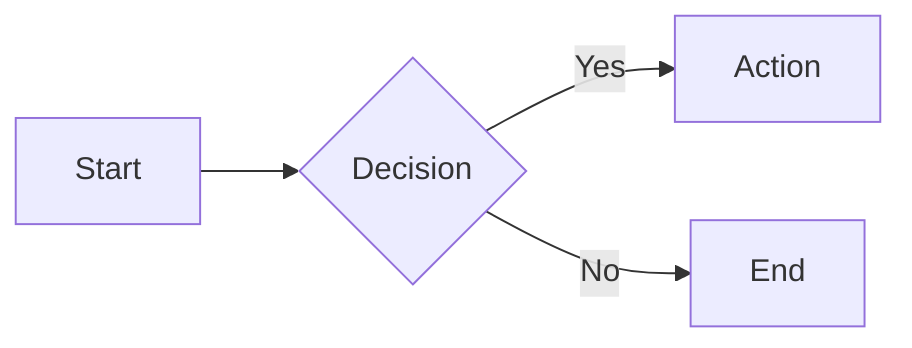
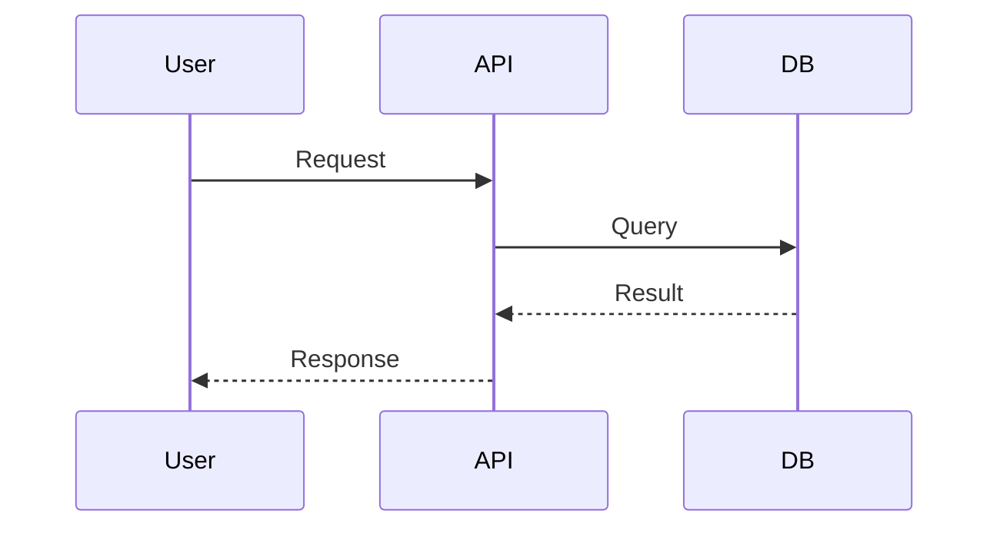
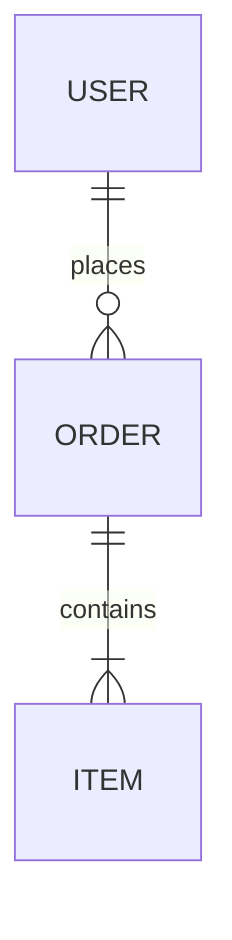

# Mermaid Quick Reference

**Flowchart:**

**Sequence:**

**ER Diagram:**

# Style Guidelines

- **Left-to-right (LR)** for processes, **top-to-bottom (TB)** for hierarchies
- **Max 10-15 nodes** per diagram, split if larger
- **Consistent naming** — all caps for systems, lowercase for actions
- **Subgraphs** to group related components
- **Color sparingly** — highlight critical paths only
